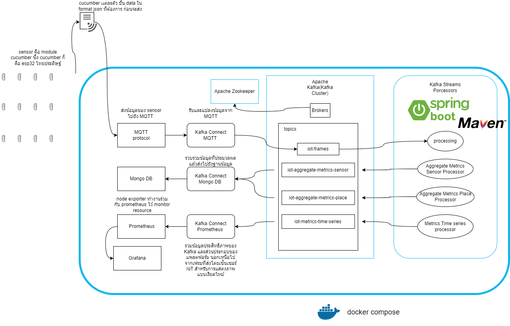

# Main Technologies of Architecture

## Architecture Overview

## Kafka Streams

- **การทำงาน:** เป็นไลบรารีของ Apache Kafka สำหรับการจัดการข้อมูลสตรีมแบบเรียลไทม์
- **การใช้งาน:** ใช้เพื่อสร้างแอปพลิเคชันการประมวลผลข้อมูลที่ทำงานได้แบบเรียลไทม์
- **ประโยชน์:** ช่วยในการสร้างแอปพลิเคชันที่สามารถประมวลผลข้อมูลที่เข้ามาโดยไม่ต้องบันทึกข้อมูลก่อน

## Spring Kafka

- **การทำงาน:** เป็นไลบรารี Spring ที่ใช้สำหรับการเชื่อมต่อและทำงานกับ Apache Kafka
- **การใช้งาน:** ใช้เพื่อบูรณาการ Kafka เข้ากับแอปพลิเคชันที่พัฒนาโดย Spring Framework
- **ประโยชน์:** ทำให้การใช้งาน Kafka ในแอปพลิเคชัน Spring ง่ายขึ้นและลดความซับซ้อนในการจัดการ

## Eclipse Paho MQTT Client

- **การทำงาน:** เป็นไลบรารีสำหรับการทำงานกับโปรโตคอล MQTT ซึ่งใช้ในการสื่อสารที่เบาและมีประสิทธิภาพ
- **การใช้งาน:** ใช้สำหรับการเชื่อมต่อและจัดการการส่งและรับข้อความผ่าน MQTT
- **ประโยชน์:** ช่วยให้การสื่อสารระหว่างอุปกรณ์และแอปพลิเคชันผ่าน MQTT เป็นไปอย่างราบรื่น

## Kafka Connect

- **การทำงาน:** เป็นเครื่องมือของ Apache Kafka ที่ใช้สำหรับการเชื่อมต่อกับระบบภายนอก
- **การใช้งาน:** ใช้สำหรับการดึงข้อมูลจากแหล่งต่างๆ เข้าสู่ Kafka และส่งข้อมูลจาก Kafka ไปยังแหล่งข้อมูลภายนอก
- **ประโยชน์:** ช่วยให้การเชื่อมต่อและการเคลื่อนย้ายข้อมูลระหว่าง Kafka และระบบภายนอกเป็นไปอย่างอัตโนมัติ

## Kafka Rest Proxy

- **การทำงาน:** เป็น RESTful API ที่ให้บริการสำหรับการทำงานกับ Apache Kafka
- **การใช้งาน:** ใช้เพื่อเข้าถึง Kafka ผ่าน HTTP REST API ซึ่งสะดวกในการเชื่อมต่อกับระบบที่ไม่ใช่ Java
- **ประโยชน์:** ช่วยให้การทำงานกับ Kafka ง่ายขึ้น โดยไม่จำเป็นต้องใช้ไลบรารี Java ของ Kafka

## Spring Boot 2.3.3 / Apache Maven 3.6.3

- **การทำงาน:** Spring Boot เป็นเฟรมเวิร์กสำหรับการพัฒนาแอปพลิเคชัน Java โดยอัตโนมัติ และ Apache Maven เป็นเครื่องมือสำหรับการจัดการการสร้างและการจัดการโครงการ Java
- **การใช้งาน:** Spring Boot ใช้สำหรับพัฒนาแอปพลิเคชันที่มีความยืดหยุ่นและง่ายต่อการปรับใช้ และ Maven ใช้สำหรับการจัดการไลบรารีและการสร้างโครงการ
- **ประโยชน์:** ช่วยให้การพัฒนาแอปพลิเคชันเป็นไปอย่างรวดเร็วและมีประสิทธิภาพ

## Spring Boot Starter Actuator

- **การทำงาน:** เป็นส่วนขยายของ Spring Boot ที่ให้เครื่องมือสำหรับการตรวจสอบและจัดการแอปพลิเคชัน
- **การใช้งาน:** ใช้สำหรับการสร้าง endpoints ที่ให้ข้อมูลเกี่ยวกับการทำงานและสถานะของแอปพลิเคชัน
- **ประโยชน์:** ช่วยให้การตรวจสอบและการจัดการแอปพลิเคชันเป็นไปอย่างง่ายดาย

## Micrometer Registry Prometheus

- **การทำงาน:** Micrometer เป็นไลบรารีสำหรับการเก็บข้อมูลการวัดผลของแอปพลิเคชัน และ Prometheus เป็นเครื่องมือการตรวจสอบและการเก็บข้อมูลการวัดผล
- **การใช้งาน:** ใช้เพื่อเก็บข้อมูลการวัดผลของแอปพลิเคชันและส่งข้อมูลเหล่านั้นไปยัง Prometheus
- **ประโยชน์:** ช่วยในการติดตามและตรวจสอบประสิทธิภาพของแอปพลิเคชัน

## NodeExporter

- **การทำงาน:** เป็นเครื่องมือสำหรับการเก็บข้อมูลการวัดผลของระบบปฏิบัติการ
- **การใช้งาน:** ใช้ในการเก็บข้อมูลการวัดผลของเซิร์ฟเวอร์ เช่น การใช้ CPU, RAM และ Disk
- **ประโยชน์:** ช่วยในการติดตามประสิทธิภาพของเซิร์ฟเวอร์และระบบ

## Prometheus

- **การทำงาน:** เป็นเครื่องมือการตรวจสอบและการเก็บข้อมูลการวัดผล
- **การใช้งาน:** ใช้เพื่อเก็บข้อมูลการวัดผลจากระบบต่างๆ และให้การวิเคราะห์และการตรวจสอบข้อมูล
- **ประโยชน์:** ช่วยในการตรวจสอบและวิเคราะห์ข้อมูลการวัดผลของระบบ

## Grafana

- **การทำงาน:** เป็นเครื่องมือการสร้างกราฟและแดชบอร์ดสำหรับการแสดงข้อมูลการวัดผล
- **การใช้งาน:** ใช้ในการสร้างกราฟและแดชบอร์ดเพื่อแสดงข้อมูลที่เก็บรวบรวมจาก Prometheus หรือแหล่งข้อมูลอื่น
- **ประโยชน์:** ช่วยในการแสดงข้อมูลการวัดผลในรูปแบบที่เข้าใจง่ายและใช้ในการวิเคราะห์

## Eclipse Mosquitto

- **การทำงาน:** เป็น MQTT broker สำหรับการส่งและรับข้อความ
- **การใช้งาน:** ใช้ในการจัดการการสื่อสารแบบ MQTT ระหว่างเซนเซอร์และแอปพลิเคชัน
- **ประโยชน์:** ช่วยในการสื่อสารข้อมูลแบบเบาและมีประสิทธิภาพระหว่างอุปกรณ์

## MongoDB

- **การทำงาน:** เป็นฐานข้อมูล NoSQL ที่เก็บข้อมูลในรูปแบบเอกสาร JSON
- **การใช้งาน:** ใช้ในการจัดเก็บและจัดการข้อมูลที่มีโครงสร้างไม่เป็นระเบียบ
- **ประโยชน์:** ช่วยในการจัดการข้อมูลที่มีความยืดหยุ่นและสามารถขยายขนาดได้ง่าย

## MongoDB Express

- **การทำงาน:** เป็นส่วนติดต่อกราฟิก (GUI) สำหรับ MongoDB ที่เขียนด้วย Node.js และ Express
- **การใช้งาน:** ใช้สำหรับการจัดการฐานข้อมูล MongoDB ผ่านทางเว็บอินเตอร์เฟซ
- **ประโยชน์:** ทำให้การจัดการฐานข้อมูล MongoDB เป็นไปได้อย่างง่ายและสะดวก

## Kafka Exporter

- **การทำงาน:** เป็นเครื่องมือสำหรับการส่งข้อมูล Kafka ไปยัง Prometheus
- **การใช้งาน:** ใช้เพื่อส่งข้อมูลการวัดผลจาก Kafka ไปยัง Prometheus สำหรับการตรวจสอบ
- **ประโยชน์:** ช่วยในการติดตามและตรวจสอบสถานะของ Kafka
