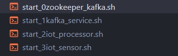

# IoT Docker Compose

## วิธีเริ่มต้น Docker Compose

1. ติดตั้ง Rufus
2. ดาวน์โหลด Ubuntu ISO เวอร์ชัน 22.04.xx
3. ใช้ Rufus เบิร์นแฟลชไดรฟ์ให้กลายเป็นอุปกรณ์บูต
4. เข้าสู่ BIOS ในเครื่อง Dell 5000
5. เปลี่ยนลำดับการบูตให้บูตผ่านแฟลชไดรฟ์ Sandisk ก่อนเสมอ
6. กดบันทึกการตั้งค่าใน BIOS
7. เครื่องจะรีสตาร์ทเอง
8. เลือก "Try or Install Ubuntu Server"
9. เลือกภาษา
10. เลือก Ubuntu Server (minimal)
11. กำหนดค่า IP Address ของฉันให้ไม่ซ้ำกัน
12. เลือก "Custom storage layout"
13. ลบข้อมูลเก่า (พาร์ติชัน)
14. ใช้พื้นที่ว่างที่มีอยู่มาตั้งเป็น Swap ขนาด 1GB ชนิดข้อมูลแบบ ext4
15. ใช้พื้นที่ที่เหลือทั้งหมดทำเป็น /
16. กด "Continue"
17. ตั้งค่า username, password, ชื่อเครื่อง, และชื่อเจ้าของเครื่อง
18. หลังดาวน์โหลดเสร็จ เลือก "Reboot now"
19. ล็อกอินด้วย user-password ในเทอร์มินัล
20. ตรวจสอบพื้นที่เก็บข้อมูลในไดรฟ์ด้วยคำสั่ง `df -h`
21. ติดตั้ง text editor ที่ชื่อว่า Nano ด้วยคำสั่ง `sudo apt-get install nano -y`
22. เข้าไปที่ `/etc/netplan`
23. ใช้ `sudo nano 00-network-config.yaml` เพื่อแก้ไขการตั้งค่าเครือข่ายให้เป็นแบบ static และเลือก Domain Name Server เป็นของโรงเรียน และตั้งค่า Domain สำรองเป็น 8.8.8.8 (Google DNS)
24. กด `Ctrl + S` เพื่อบันทึก
25. กด `Ctrl + X` เพื่อออก
26. ใช้คำสั่ง `sudo netplan apply`
27. ใช้คำสั่ง `sudo reboot now`
28. ติดตั้ง GitHub
29. ติดตั้ง Docker
30. Clone GitHub ของอาจารย์มาลง
31. ใช้คำสั่ง `docker compose up`

## ปัญหาที่พบ

1. Kafka ไม่เริ่มต้น
2. Kafka error 404

## วิธีแก้ปัญหา

1. ใช้คำสั่ง `docker compose restart kafka`
2. ใช้คำสั่ง `docker compose logs -f | egrep 'WARN|ERR'` เพื่อดู logs จาก Docker Compose ที่มีข้อความ "WARN" หรือ "ERR"

# ภาพรวมของบริการใน Docker Compose

## ZooKeeper
- **วัตถุประสงค์:** ให้บริการการจัดเก็บการกำหนดค่าที่กระจาย, การตั้งชื่อ, การซิงโครไนซ์, และบริการกลุ่มสำหรับคลัสเตอร์ Kafka
- **พอร์ต:** 2181
- **ข้อมูลที่เก็บ:** `/var/lib/zookeeper/data` และ `/var/lib/zookeeper/log`
- **การตั้งค่า:** ออกแบบให้ "fail-fast" และจะรีสตาร์ทอัตโนมัติเมื่อหยุดทำงาน

## Kafka
- **วัตถุประสงค์:** แพลตฟอร์มสตรีมมิ่งแบบกระจายสำหรับสร้างท่อข้อมูลและแอปพลิเคชันสตรีมมิ่งแบบเรียลไทม์
- **การเชื่อมต่อกับ ZooKeeper:** ใช้พอร์ต 9092
- **คุณสมบัติ:** รองรับการบีบอัดข้อมูลและการสร้างหัวข้ออัตโนมัติ

## Kafka REST Proxy
- **วัตถุประสงค์:** ให้ส่วนต่อประสาน RESTful กับคลัสเตอร์ Kafka เพื่อให้ง่ายต่อการผลิตและบริโภคข้อความ
- **พอร์ต:** 8082
- **การเชื่อมต่อ:** ใช้ ZooKeeper และ Kafka สำหรับการเชื่อมต่อเบื้องต้น

## Kafka Connect
- **วัตถุประสงค์:** เฟรมเวิร์กสำหรับเชื่อมต่อ Kafka กับระบบภายนอก เช่น ฐานข้อมูลและระบบไฟล์
- **พอร์ต:** 8083
- **การตั้งค่า:** ใช้หัวข้อใน Kafka สำหรับการจัดเก็บข้อมูลการกำหนดค่าและสถานะ

## Mosquitto (MQTT Broker)
- **วัตถุประสงค์:** โบรกเกอร์ MQTT แบบโอเพ่นซอร์สที่รองรับการสื่อสารแบบ publish/subscribe เหมาะสำหรับอุปกรณ์ IoT
- **พอร์ต:** 1883 และ 9001

## MongoDB
- **วัตถุประสงค์:** ฐานข้อมูล NoSQL ที่จัดเก็บข้อมูลในรูปแบบเอกสาร
- **การตั้งค่า:** กำหนดค่าในไฟล์ `.env` สำหรับการยืนยันตัวตน

## Grafana
- **วัตถุประสงค์:** แพลตฟอร์มการแสดงข้อมูลสำหรับสร้างแดชบอร์ดเพื่อตรวจสอบและแสดงข้อมูลแบบเรียลไทม์
- **พอร์ต:** 8085
- **ปลั๊กอิน:** รองรับปลั๊กอินเพิ่มเติม เช่น Grafana Clock, Worldmap, และ Piechart

## Prometheus
- **วัตถุประสงค์:** ระบบสำหรับรวบรวมเมตริกในฐานข้อมูลแบบ time-series และแจ้งเตือนตามการเปลี่ยนแปลงของเมตริก
- **พอร์ต:** 8086
- **การตั้งค่า:** ใช้ไฟล์การกำหนดค่า Prometheus สำหรับการตั้งค่าเมตริก

## IoT Processor
- **วัตถุประสงค์:** ประมวลผลข้อมูลจากเซนเซอร์ IoT
- **พอร์ต:** 8080
- **การเชื่อมต่อ:** ขึ้นอยู่กับ Kafka Connect

บริการเหล่านี้ทำงานร่วมกันเพื่อสร้างสภาพแวดล้อมสำหรับการสตรีมและตรวจสอบข้อมูลแบบเรียลไทม์ โดยมีการเชื่อมต่อระหว่างบริการผ่านพอร์ตต่างๆ ซึ่งสามารถปรับแต่งได้ตามต้องการ

## การเริ่มต้นบริการ

ต้องไปรันไฟล์ `start.sh` ทั้ง 4 ตัวเรียงกัน โดยต้องเปิด Terminal ทิ้งไว้ด้วย




# Docker Compose File

```yaml
volumes:
  prometheus_data: {}
  grafana_data: {}
  zookeeper-data:
    driver: local
  zookeeper-log:
    driver: local
  kafka-data:
    driver: local

services:
  zookeeper:
    image: confluentinc/cp-zookeeper:latest
    container_name: zookeeper
    restart: unless-stopped
    volumes:
      - zookeeper-data:/var/lib/zookeeper/data
      - zookeeper-log:/var/lib/zookeeper/log
    environment:
      ZOOKEEPER_CLIENT_PORT: 2181
      ZOOKEEPER_LOG4J_ROOT_LOGLEVEL: INFO
      ZOOKEEPER_LOG4J_PROP: INFO,ROLLINGFILE
      ZOOKEEPER_LOG_MAXFILESIZE: 10MB
      ZOOKEEPER_LOG_MAXBACKUPINDEX: 10
      ZOOKEEPER_SNAP_COUNT: 10
      ZOOKEEPER_AUTOPURGE_SNAP_RETAIN_COUNT: 10
      ZOOKEEPER_AUTOPURGE_PURGE_INTERVAL: 3

  kafka:
    image: confluentinc/cp-kafka:latest
    container_name: kafka
    ports:
      - '9092:9092'
    volumes:
      - kafka-data:/var/lib/kafka
    restart: unless-stopped
    environment:
      KAFKA_ZOOKEEPER_CONNECT: zookeeper:2181
      KAFKA_NUM_PARTITIONS: 1
      KAFKA_COMPRESSION_TYPE: gzip
      KAFKA_OFFSETS_TOPIC_REPLICATION_FACTOR: 1
      KAFKA_TRANSACTION_STATE_LOG_REPLICATION_FACTOR: 1
      KAFKA_TRANSACTION_STATE_LOG_MIN_ISR: 1
      KAFKA_ADVERTISED_LISTENERS: PLAINTEXT://kafka:9092
      KAFKA_AUTO_CREATE_TOPICS_ENABLE: 'true'
    links:
      - zookeeper

  kafka-rest-proxy:
    image: confluentinc/cp-kafka-rest:latest
    container_name: kafka-rest-proxy
    environment:
      KAFKA_REST_ZOOKEEPER_CONNECT: zookeeper:2181
      KAFKA_REST_LISTENERS: http://0.0.0.0:8082/
      KAFKA_REST_HOST_NAME: kafka-rest-proxy
      KAFKA_REST_BOOTSTRAP_SERVERS: kafka:9092
    restart: unless-stopped
    ports:
      - "9999:8082"
    depends_on:
      - zookeeper
      - kafka

  kafka-connect:
    image: confluentinc/cp-kafka-connect:latest
    hostname: kafka-connect
    container_name: kafka-connect
    environment:
      CONNECT_BOOTSTRAP_SERVERS: "kafka:9092"
      CONNECT_GROUP_ID: kafka-connect-group
      CONNECT_CONFIG_STORAGE_TOPIC: kafka-connect-meta-configs
      CONNECT_OFFSET_STORAGE_TOPIC: kafka-connect-meta-offsets
      CONNECT_STATUS_STORAGE_TOPIC: kafka-connect-meta-status
      CONNECT_KEY_CONVERTER: org.apache.kafka.connect.json.JsonConverter
      CONNECT_VALUE_CONVERTER: org.apache.kafka.connect.json.JsonConverter
      CONNECT_REST_ADVERTISED_HOST_NAME: "kafka-connect"
      CONNECT_REST_PORT: 8083
      CONNECT_CONFIG_STORAGE_REPLICATION_FACTOR: "1"
      CONNECT_OFFSET_STORAGE_REPLICATION_FACTOR: "1"
      CONNECT_STATUS_STORAGE_REPLICATION_FACTOR: "1"
      CONNECT_PLUGIN_PATH: "/usr/share/java,/data/connectors/"
      CONNECT_LOG4J_ROOT_LOGLEVEL: "INFO"
    restart: unless-stopped
    volumes:
      - ./kafka_connect/data:/data
    command: 
      - bash 
      - -c 
      - |
        echo "Launching Kafka Connect worker"
        /etc/confluent/docker/run & 
        while [ $$(curl -s -o /dev/null -w %{http_code} http://$$CONNECT_REST_ADVERTISED_HOST_NAME:$$CONNECT_REST_PORT/connectors) -ne 200 ] ; do 
          echo -e $$(date) " Kafka Connect listener HTTP state: " $$(curl -s -o /dev/null -w %{http_code} http://$$CONNECT_REST_ADVERTISED_HOST_NAME:$$CONNECT_REST_PORT/connectors) " (waiting for 200)"
          sleep 5 
        done
        nc -vz $$CONNECT_REST_ADVERTISED_HOST_NAME $$CONNECT_REST_PORT
        /data/scripts/create_mongo_sink.sh 
        /data/scripts/create_mqtt_source.sh
        /data/scripts/create_prometheus_sink.sh
        sleep infinity
    depends_on:
      - zookeeper
      - kafka

  zoonavigator:
    image: elkozmon/zoonavigator:latest
    container_name: zoonavigator
    restart: unless-stopped
    ports:
      - "9000:9000"
    environment:
      HTTP_PORT: 9000
    depends_on:
      - zookeeper

  mosquitto:
    image: eclipse-mosquitto:latest
    hostname: mosquitto
    container_name: mosquitto
    restart: unless-stopped
    ports:
      - "1883:1883"
      - "9001:9001"
    volumes:
      - ./mosquitto/config:/mosquitto/config
      - ./mosquitto/data:/mosquitto/data
      - ./mosquitto/log:/mosquitto/log

  mongo:
    image: mongo:4.4.6
    container_name: mongo
    env_file:
      - .env
    restart: unless-stopped
    environment:
      - MONGO_INITDB_ROOT_USERNAME=${MONGO_ROOT_USER}
      - MONGO_INITDB_ROOT_PASSWORD=${MONGO_ROOT_PASSWORD}
      - MONGO_INITDB_DATABASE=${MONGO_DB}

  mongo-express:
    image: mongo-express
    container_name: mongo-express
    restart: unless-stopped
    ports:
      - "8081:8081"
    depends_on:
      - mongo

```

```sh
docker compose up zookeeper kafka
```

```sh
docker compose up kafka-rest-proxy kafka-connect mosquitto mongo grafana prometheus
```

```sh
docker compose up iot-processor
```

```sh
docker compose up iot_sensor_1
```
