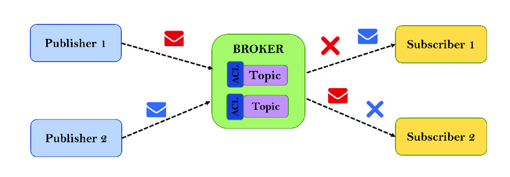

# MQTT

## หลักการทำงานคร่าวๆ ของ MQTT มีดังนี้
- MQTT Broker
- MQTT Clients
- MQTT Topics
- MQTT Payload
- MQTT actors

### MQTT Broker 
ทำหน้าที่เหมือนกับนายหน้าขายของ amway เเต่ในที่นี้คือจะเป็นนายหน้าจะคอยจัดการระบบ `pipe line` ซึ่งระบบนี้ มันไม่เหมือน restfull api มันจะส่ง data เป็นสาย(streaming data) broker ทุกตัวจะบริหารจัดการท่อ pipeline ให้ส่งข้อมูล stream ข้อมูลมหาศาลได้ 

### MQTT Clients
คือตัวลุกข่ายที่จะต้อง ``subscribe topic`` เเละรับข้อมูลมาจาก topic นั้นๆ เเบบรับเป็นสายข้อมูล streamdata เช่น รับอุณหภุมิมาอย่างต่อเนื่อง เพื่อจะเอามาเเสดงในหน้า dashboard

### MQTT Topics
เป็นหัวข้อเรื่อง ให้ actors มา `subscribe` เเล้ว public ข้อมูลลงเเบบ realtime
ให้ client มา subscribe แล้วดึงข้อมูลออกมาเเบบ realtime  เพื่อมาเเสดงข้อมูลลงหน้า dashboard

### MQTT Payload
ข้อมูลที่ถุกส่งไปใน pipline

### MQTT actors
ตามจริงเรียกได้หลายเเบบ เเต่หลักๆ เลย มันจะเป็นตัวที่ `subscribe topic` เเละ `publish data` ลงไปใน topic นั้นๆ 

เเหล่งข้อมูลเพิ่มเติม

[https://www.youtube.com/watch?v=jTeJxQFD8Ak&list=PLRkdoPznE1EMXLW6XoYLGd4uUaB6wB0wd](https://www.youtube.com/watch?v=jTeJxQFD8Ak&list=PLRkdoPznE1EMXLW6XoYLGd4uUaB6wB0wd)