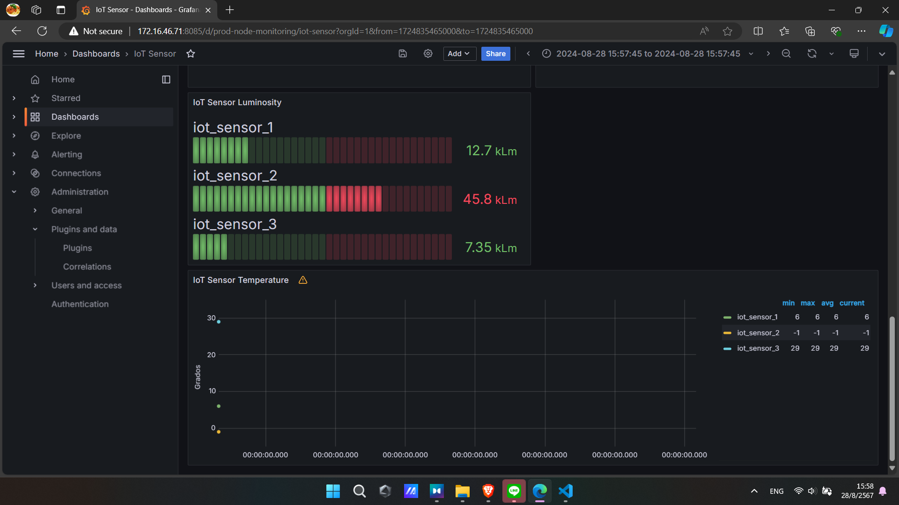

# Data Visualization.


อันนี้คือ map visualization


line visualization

card visualization

guage visualization

line chart with area chart




เเต่ละเเบบก็ทำให้เรา มอง เเละวิเคราะข้อมูลได้ในมุมมองเเบบต่างๆ หลายมุมมากขขึ้น


จากรูป นี่คือการ setting map visualization


ใส่ rule ให้เเต่ละ sen


ในเเต่ละ rule ให้ใส่ name ของ sensor


ต่อไปให้ focus ที่ menu หัวข้อ query ตรง option ตอนเเรกมันเป็น json อะไรยาวๆ เยอะๆ ให้ลบออก เเล้ว extract เเต่ sensor name ตามในรูป

```js
{{sensor_name}}
```
เป็น meta programming ของ ภาษา java script มันคือการเเตกเอาตัวที่ใน object มาลงในตัวเเปร

```js
let data = {spa1: 1, spa2: 2, spa3: 3}
let {spa1} = data ## ผมเรียกตรงนี้ว่า เเตก obj
console.log(spa1)
## output 1
```

เเต่ใน grafana เราเเตก sensor name มาใช้ เพราะว่าข้อมูลชิดนี้มี variance ที่ต่ำสุด ค่อนข้างเเน่นอน เเละสามารถเอา code ยำใส่ grafana ได้เลย โดยที่ไม่ต้องรอรับ sensor พร้อมกัน 10 ตัว

# visualization ให้เพื่อนๆ เเละครูดูตอนสอบ


