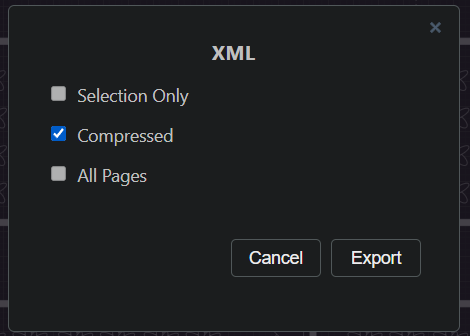

# ส่งงาน Data Visualization.

นี่คือผลลัพท์ dashboard ตอนมี sensor เเค่ 2 ตัว


นี่คือผลลัพท์ dashboard ตอนมี sensor เพื่อนๆ ทั้งหมด


นี่คือผลลัพท์ multi-line chart virsualization


นำ data ที่ได้มานำเสนอให้เพื่อนๆ ในห้องดู ผ่านการทำ datavisualization


# ขั้นตอนในการทำ map visualization

จากรูปคือ plan ที่ทำด้วย drawio


จากรูปคือการ export plan ออกมาเป็น xml เพื่อเอาไปใช้ในขั้นตอนต่อไป


จากรูปคือการ ตั้งค่าให้เป็น plan เเบบ compress เพื่อให้ใช้งานร่วมกับ extention flowcharting ใน grafana ได้


เอา source file xml ของตัวที่เเล้ว มาใส่ในกรอบด้านขวาล่าง


เเต่ละเเบบก็ทำให้เรา มอง เเละวิเคราะข้อมูลได้ในมุมมองเเบบต่างๆ หลายมุมมากขขึ้น


ใส่ rule ให้เเต่ละ sen


ในเเต่ละ rule ให้ใส่ name ของ sensor


ต่อไปให้ focus ที่ menu หัวข้อ query ตรง option ตอนเเรกมันเป็น json อะไรยาวๆ เยอะๆ ให้ลบออก เเล้ว extract เเต่ sensor name ตามในรูป


```js
{{sensor_name}}
```
เป็น meta programming ของ ภาษา java script มันคือการเเตกเอาตัวที่ใน object มาลงในตัวเเปร

```js
let data = {spa1: 1, spa2: 2, spa3: 3}
let {spa1} = data ## ผมเรียกตรงนี้ว่า เเตก obj
console.log(spa1)
## output 1
```

เเต่ใน grafana เราเเตก sensor name มาใช้ เพราะว่าข้อมูลชิดนี้มี variance ที่ต่ำสุด ค่อนข้างเเน่นอน เเละสามารถเอา code ยำใส่ grafana ได้เลย โดยที่ไม่ต้องรอรับ sensor พร้อมกัน 10 ตัว

# visualization ให้เพื่อนๆ เเละครูดูตอนสอบ


# Data Visualization

## ข้อมูลที่แสดงในส่วนของ Visualization ใน Grafana

### ข้อมูลเซนเซอร์

1. **อุณหภูมิ (Temperature):**
   - แสดงค่าอุณหภูมิที่อ่านจากเซนเซอร์ BMP280
   - รูปแบบการแสดงผล: กราฟเส้น (Line Chart) หรือกราฟแท่ง (Bar Chart)
   - วัตถุประสงค์: เพื่อแสดงการเปลี่ยนแปลงของอุณหภูมิในช่วงเวลาต่างๆ

2. **ความดัน (Pressure):**
   - แสดงค่าแรงดันที่อ่านจากเซนเซอร์ BMP280
   - รูปแบบการแสดงผล: กราฟเส้นหรือกราฟแท่ง
   - วัตถุประสงค์: เพื่อให้เห็นการเปลี่ยนแปลงของแรงดัน

3. **ความชื้น (Humidity):**
   - แสดงค่าความชื้นที่อ่านจากเซนเซอร์ SHT4x
   - รูปแบบการแสดงผล: กราฟเส้นหรือกราฟแท่ง

4. **ความสว่าง (Luminosity):**
   - แสดงค่าความสว่างที่อ่านจากเซนเซอร์อนาล็อก
   - รูปแบบการแสดงผล: กราฟเส้นหรือกราฟแท่ง

### ข้อมูลการทำงานของเซนเซอร์

1. **สถานะการเชื่อมต่อ (Connection Status):**
   - แสดงสถานะการเชื่อมต่อ WiFi และ MQTT
   - รูปแบบการแสดงผล: กราฟหรือไอคอนที่เปลี่ยนสีตามสถานะการเชื่อมต่อ (สีเขียวสำหรับเชื่อมต่อสำเร็จ, สีแดงสำหรับเชื่อมต่อไม่สำเร็จ)

### ข้อมูลข้อผิดพลาด (Error Information)

1. **ข้อผิดพลาดของเซนเซอร์ (Sensor Errors):**
   - แสดงข้อมูลข้อผิดพลาดที่เกิดขึ้น เช่น จำนวนข้อผิดพลาดที่เกิดขึ้นในช่วงเวลาต่างๆ
   - รูปแบบการแสดงผล: ข้อความข้อผิดพลาดในกราฟหรือบาร์

### ข้อมูลเชิงเวลา (Time Series Data)

1. **กราฟเวลาสำหรับเซนเซอร์ (Time Series Graphs):**
   - แสดงข้อมูลเซนเซอร์ในรูปแบบกราฟเวลาที่แสดงการเปลี่ยนแปลงของค่าอุณหภูมิ, ความดัน, ความชื้น และความสว่างตามเวลา

### ข้อมูลสถิติ (Statistical Information)

1. **ค่าความเฉลี่ย (Averages):**
   - แสดงค่าเฉลี่ยของข้อมูลเซนเซอร์ในช่วงเวลาที่กำหนด

2. **ค่าต่ำสุดและสูงสุด (Min/Max Values):**
   - แสดงค่าต่ำสุดและสูงสุดที่บันทึกได้ในช่วงเวลาที่กำหนด

### ตัวอย่างการแสดงข้อมูลใน Grafana (Grafana Visualization Examples)

- **กราฟเส้นสำหรับอุณหภูมิ (Temperature Line Graph):** แสดงการเปลี่ยนแปลงของอุณหภูมิในช่วงเวลาต่างๆ
  - **ตัวอย่างการใช้งาน:** ใช้เพื่อวิเคราะห์แนวโน้มของอุณหภูมิในแต่ละวันหรือสัปดาห์ เพื่อดูว่าอุณหภูมิเพิ่มขึ้นหรือลดลงในช่วงเวลาต่างๆ

- **กราฟแท่งสำหรับความดัน (Pressure Bar Chart):** แสดงค่าแรงดันในช่วงเวลาต่างๆ
  - **ตัวอย่างการใช้งาน:** ใช้เพื่อเปรียบเทียบค่าแรงดันในช่วงเวลาที่กำหนด เช่น การเปรียบเทียบค่าแรงดันในแต่ละชั่วโมงของวัน

- **กราฟเส้นสำหรับความชื้น (Humidity Line Graph):** แสดงการเปลี่ยนแปลงของความชื้นในช่วงเวลาต่างๆ
  - **ตัวอย่างการใช้งาน:** ใช้เพื่อดูความชื้นในสภาพแวดล้อมที่เปลี่ยนแปลงตามฤดูกาลหรือช่วงเวลาของวัน

- **กราฟแท่งสำหรับความสว่าง (Luminosity Bar Chart):** แสดงค่าความสว่างในช่วงเวลาต่างๆ
  - **ตัวอย่างการใช้งาน:** ใช้เพื่อวัดความสว่างในแต่ละช่วงเวลาของวัน เช่น การตรวจสอบความสว่างในตอนเช้าและตอนเย็น

- **ไอคอนสถานะการเชื่อมต่อ (Connection Status Icon):** เปลี่ยนสีตามสถานะการเชื่อมต่อ WiFi และ MQTT
  - **ตัวอย่างการใช้งาน:** ใช้เพื่อตรวจสอบสถานะการเชื่อมต่อของระบบ หากไอคอนเป็นสีเขียวหมายถึงการเชื่อมต่อสำเร็จ หากเป็นสีแดงหมายถึงการเชื่อมต่อล้มเหลว
